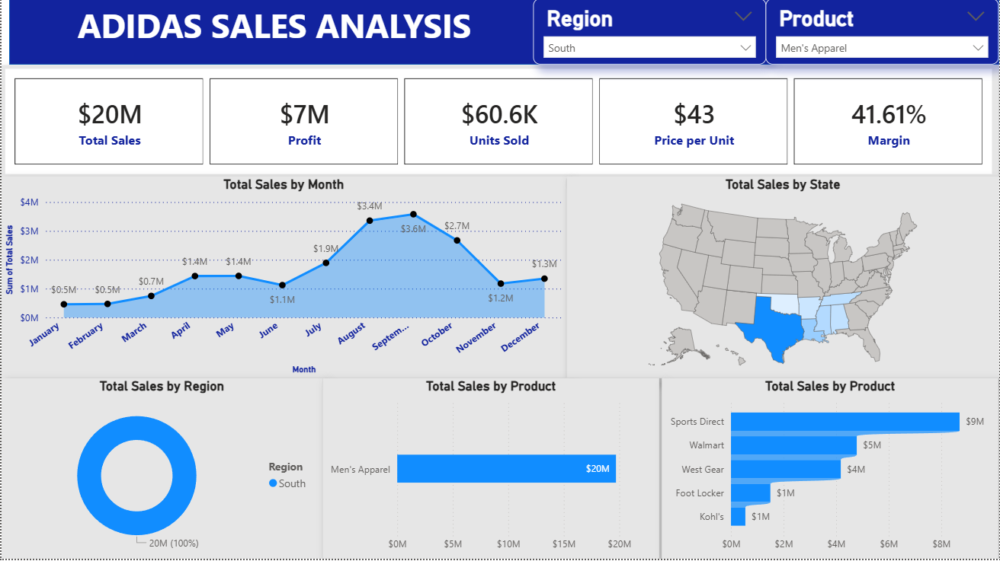

# Adidas Sales Dashboard (Power BI)

## Project Overview
This project presents an interactive Power BI dashboard that analyzes Adidas sales performance across different regions, products, and time periods. The dashboard helps identify sales trends, top-performing regions, and product categories.

## Objective
The goal of this project is to analyze Adidas sales data and provide meaningful insights that can help in business decision-making and performance monitoring.

## Tools Used
- Power BI
- Microsoft Excel
- Data Visualization
- Data Analysis

## Dataset
The dataset used in this project contains Adidas sales information including:
- Retailer
- Region
- Product Category
- Units Sold
- Total Sales
- Operating Profit
- Sales Date

## Dashboard Features
The dashboard includes the following key visualizations:

- Total Sales KPI
- Total Units Sold
- Operating Profit
- Sales by Region
- Sales by Product Category
- Sales Trend Over Time
- Top Performing Products
- Interactive Filters and Slicers

## Key Insights
- Identified the regions contributing the highest sales.
- Analyzed product categories with the best performance.
- Observed monthly and yearly sales trends.
- Compared operating profit across different regions.

## Files in this Repository
- Adidas-sales-dashboard.pbix – Power BI dashboard file
- Adidas.xlsx – Sales dataset used for analysis
- adidas.png – Dashboard preview image

## Dashboard Preview

## Author
Jeevan Kumar Thangavel

## Project Purpose
This project is part of my Data Analyst portfolio to demonstrate my skills in data analysis, data visualization, and business intelligence using Power BI.
